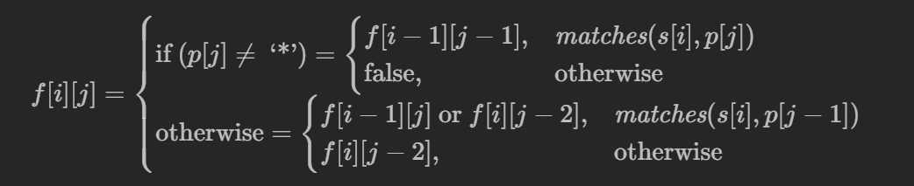

+++
date = '2026-01-06T10:17:24+08:00'
draft = false
title = '10. 正则表达式匹配'
categories = ['Leetcode Hot 100']
tags = ['动态规划', '字符串']
description = '困难 · 动态规划 · 字符串'
+++

## 题目

[10. 正则表达式匹配](https://leetcode.cn/problems/regular-expression-matching/description/?envType=problem-list-v2&envId=2cktkvj)  
[官方题解](https://leetcode.cn/problems/regular-expression-matching/solutions/522491/zheng-ze-biao-da-shi-pi-pei-by-leetcode-solution/?envType=problem-list-v2&envId=2cktkvj)

## 方法1：动态规划

详见官方题解。

状态转移方程



```cpp
class Solution {
public:
    bool matches(string s, string p, int i, int j) {
        if (i == 0) return false;

        if (p[j - 1] == '.') return true;

        return s[i - 1] == p[j - 1];
    }

    bool isMatch(string s, string p) {
        int m = s.size(), n = p.size();

        vector<vector<int>> f(m +1, vector<int>(n +1));
        f[0][0] = true;
        for (int i = 0; i <= m; i ++) {
            for (int j = 1; j <= n; j ++) {
                if (p[j - 1] == '*') {
                    f[i][j] = f[i][j - 2];
                    if (matches(s, p, i, j - 1)) {
                        f[i][j] |= f[i - 1][j];
                    }
                } else {
                    if (matches(s, p, i, j)) {
                        f[i][j] = f[i - 1][j - 1];
                    }
                }
            }
        }
        return f[m][n];
    }
};
```


## 小结

好难，好难啊！