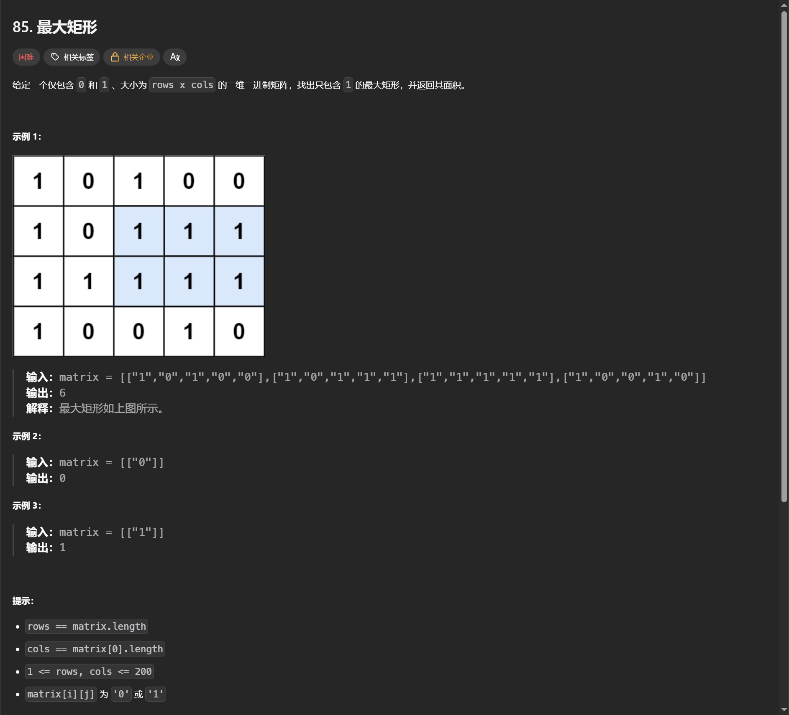
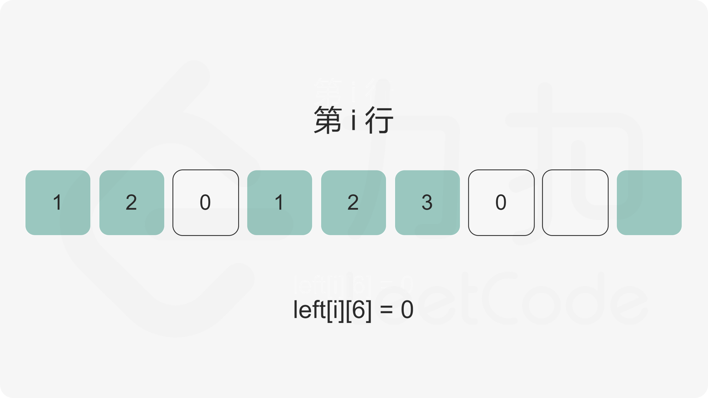

+++
date = '2026-01-04T10:37:02+08:00'
title = '85. 最大矩形'
description = '困难 · 动态规划 · 单调栈优化'
categories = ['Leetcode Hot 100']
tags = ['动态规划', '矩阵']
+++


## 题目
[85. 最大矩形](https://leetcode.cn/problems/maximal-rectangle/description/?envType=problem-list-v2&envId=2cktkvj)
[官方题解](https://leetcode.cn/problems/maximal-rectangle/solutions/535672/zui-da-ju-xing-by-leetcode-solution-bjlu/?envType=problem-list-v2&envId=2cktkvj)



刚开始想了一个暴力的解法，但是理解错误题目意思了，是矩形不是正方形。

```cpp
class Solution {
public:
    bool isTrue(vector<vector<char>>& matrix, int i, int j, int size) {
        for (int x = i; x < i + size; x ++) {
            for (int y = j; y < j + size; y ++) {
                if (matrix[x][y] == '0') return false;
            }
        }
        return true;
    }

    int maximalSquare(vector<vector<char>>& matrix) {
        int max_size = min(matrix.size(), matrix[0].size());
        for (int i = max_size; i > 0; i --) {
            for (int j = 0; j + i <= matrix.size(); j ++) {
                for (int k = 0; k + i <= matrix[0].size(); k ++) {
                    // 判断是否
                    if (isTrue(matrix, j, k, i)) return i * i;
                }
            }
        }
        return 0;
    }
};
```

**时间复杂度**

O((mn)^2)，m 和 n 分别是矩阵的行数和列数。

实际上是原题 [221. 最大正方形](https://leetcode.cn/problems/maximal-square/)

动态规划写法

$$
dp(i,j)=\min(dp(i−1,j),dp(i−1,j−1),dp(i,j−1))+1
$$

```cpp
class Solution {
public:
    int maximalSquare(vector<vector<char>>& matrix) {
        if (matrix.size() == 0 || matrix[0].size() == 0) {
            return 0;
        }   
        int maxSide = 0;
        int rows = matrix.size(), columns = matrix[0].size();
        vector<vector<int>> dp(rows, vector<int>(columns));
        for (int i = 0; i < rows; i ++) {
            for (int j = 0; j < columns; j ++) {
                if (matrix[i][j] == '1') {
                    if (i == 0 || j == 0) {
                        dp[i][j] = 1;
                    } else {
                        dp[i][j] = min(dp[i - 1][j - 1], min(dp[i - 1][j], dp[i][j - 1])) + 1;
                    }
                    maxSide = max(maxSide, dp[i][j]);
                }
            } 
        }
        return maxSide * maxSide;
    }
};
```

## 回到原题
暴力枚举

```cpp
class Solution {
public:
    bool isTrue(vector<vector<char>>& matrix, int i, int j, int x, int y) {
        // 判断 (i, j) (x, y) 矩形
        for (int k = i; k <= x; k ++) {
            for (int l = j; l <= y; l ++) {
                if (matrix[k][l] == '0') {
                    return false;
                }
            }
        }
        return true;
    }

    int maximalRectangle(vector<vector<char>>& matrix) {
        if (matrix.size() == 0 || matrix[0].size() == 0) return 0;
        int rows = matrix.size(), columns = matrix[0].size();
        int maxSize = 0;
        for (int i = 0; i < rows; i ++) 
            for (int j = 0; j < columns; j ++) 
                if (matrix[i][j] == '1') {
                    // 枚举右下角坐标
                    for (int x = i; x < rows; x ++) {
                        for (int y = j; y < columns; y ++ ) {
                            if (isTrue(matrix, i, j, x, y)) {
                                maxSize = max(maxSize, (x - i + 1) * (y - j + 1));
                            }
                        }
                    }
                }

        return maxSize;
    }
};
```

**时间复杂度**

O((mn)^3)，m 和 n 分别是矩阵的行数和列数。

70/75 TLE

## 暴力优化


我们首先计算出矩阵的每个元素的左边连续 1 的数量，使用二维数组 left 记录，其中 left[i][j] 为矩阵第 i 行第 j 列元素的左边连续 1 的数量。


```cpp
class Solution {
public:
    int maximalRectangle(vector<vector<char>>& matrix) {
        if (matrix.size() == 0 || matrix[0].size() == 0) return 0;

        int rows = matrix.size(), columns = matrix[0].size();
        vector<vector<int>> left(rows, vector<int>(columns));
        for (int i = 0; i < rows; i ++) {
            for (int j = 0; j < columns; j ++) {
                // 判断(i, j) 左侧有多少个连续的1
                if (matrix[i][j] == '1') {
                    left[i][j] = (j == 0 ? 1 : left[i][j - 1] + 1);
                }
            }
        }

        int ret = 0;
        for (int i = 0; i < rows; i ++) {
            for (int j = 0; j < columns; j ++) {
                if (matrix[i][j] == '0') {
                    continue;
                }

                int width = left[i][j];
                int area = width;
                for (int k = i - 1; k >= 0; k --) {
                    width = min(width, left[k][j]);
                    area = max(area, width * (i - k + 1));
                }
                ret = max(ret, area);
            }
        }
        return ret;
    }
};
```

还是动态规划，提示标签里有单调栈，先放一放


